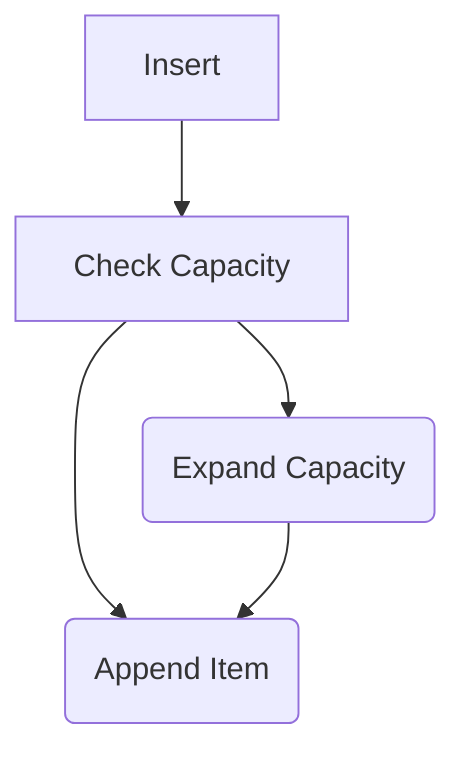
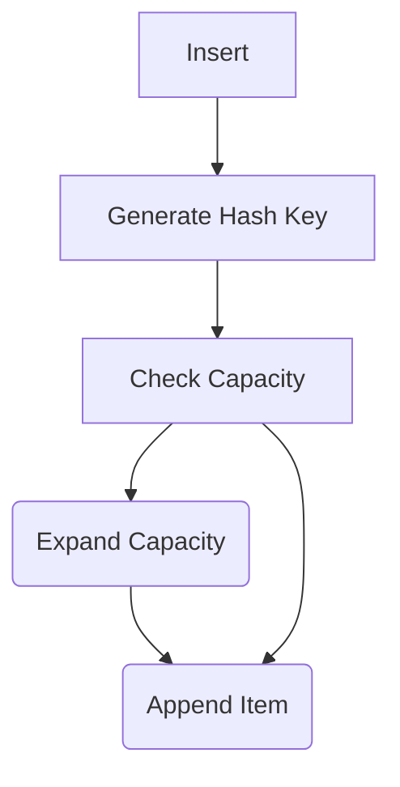

# Structures

You probably don't really want to have to write an `if` statement covering every user in your enterprise. Instead, you want to store usernames and passwords in a structure, along with the user's role.

## Basic Structures

> The code for this is found in `login_lib_struct` and `login_struct`.

You can define a simple structure like this:

```rust
pub struct User {
    pub username: String,
    pub password: String,
    pub role: LoginRole,
}
```

Structs aren't object-oriented, but they share some commonality with objects from other languages. You can define methods on them, and you can define associated functions (functions that are called on the type, not on an instance of the type). Let's make a constructor:

```rust
impl User {
    pub fn new(username: &str, password: &str, role: LoginRole) -> User {
        User {
            username: username.to_lowercase(),
            password: password.to_string(),
            role,
        }
    }
}
```

## Array of Structures

Let's create a function that creates an array of users:

```rust
pub fn get_users() -> [User; 2] {
    [
        User::new("admin", "password", LoginRole::Admin),
        User::new("bob", "password", LoginRole::User),
    ]
}
```

Arrays can never change in size, so with an array you are stuck with two users. Arrays do have the advantage of remaining on the stack, making them very fast to access.

Let's modify the `login` function to use this array:

```rust
pub fn login(username: &str, password: &str) -> Option<LoginAction> {
    let users = get_users();
    if let Some(user) = users.iter().find(|user| user.username == username) {
        if user.password == password {
            return Some(LoginAction::Granted(user.role));
        } else {
            return Some(LoginAction::Denied);
        }
    }
    None
}
```

`if let` works just like `match`, but for a single case. You can also write `match users.iter().find(|user| user.username == username && user.password == password) { Some(user) => LoginAction::from(user.role), None => LoginAction::Denied }` if you prefer.

This doesn't compile. Enumerations aren't copyable by default, because there's no guaranty that the contents are copyable. Add `#[derive(Clone)]` to the `Role` enumeration to make it clonable, and return a *clone* of the role:

```rust
pub fn login(username: &str, password: &str) -> Option<LoginAction> {
    let users = get_users();
    if let Some(user) = users.iter().find(|user| user.username == username) {
        if user.password == password {
            return Some(LoginAction::Granted(user.role.clone()));
        } else {
            return Some(LoginAction::Denied);
        }
    }
    None
}
```

We can test this with the login program, which hasn't changed.

# Vectors

Vectors are like arrays, but can change size. They are stored on the heap, so they are slower than arrays, but they are still fast. They are the most common collection type in Rust. Vectors guarantee that everything will be stored contiguously. They also allocate spare space - so you are using more memory than you need, but you don't have to reallocate as often. Vectors double in size every time you run out of capacity---which makes them fast, but you can waste a lot of memory if you don't need it.

> The code for this example is in `login_lib_vec` and `login_vec`.

Let's create a vector of users:

```rust
pub fn get_users() -> Vec<User> {
    vec![
        User::new("admin", "password", LoginRole::Admin),
        User::new("bob", "password", LoginRole::User),
    ]
}
```

The `vec!` macro is a helper that moves a list of entries in array format into a vector. You can also do:

```rust
pub fn get_users() -> Vec<User> {
    let mut users = Vec::new();
    users.push(User::new("admin", "password", LoginRole::Admin));
    users.push(User::new("bob", "password", LoginRole::User));
    users
}
```

Now the great part is that the `login` function doesn't need to change. Iterators are standardized across most collection types, so you can use the same code for arrays and vectors.

## Vector Growth

> Tip: if you know how big a vector should be, you can create it with `Vec::with_capacity(n)` to avoid reallocation.

> The code for this section is in `vector_growth`.

Let's create a quick side project to see how vectors grow. Create a new project with `cargo new vector_growth`. Don't forget to update the workspace! Add this to `src/main.rs`:

```rust
fn main() {
    let mut my_vector = Vec::new();
    for _ in 0..20 {
        my_vector.push(0);
        println!("Size: {}, Capacity: {}", my_vector.len(), my_vector.capacity());
    }
}
```

This shows:

```
Size: 1, Capacity: 4
Size: 2, Capacity: 4
Size: 3, Capacity: 4
Size: 4, Capacity: 4
Size: 5, Capacity: 8
Size: 6, Capacity: 8
Size: 7, Capacity: 8
Size: 8, Capacity: 8
Size: 9, Capacity: 16
Size: 10, Capacity: 16
Size: 11, Capacity: 16
Size: 12, Capacity: 16
Size: 13, Capacity: 16
Size: 14, Capacity: 16
Size: 15, Capacity: 16
Size: 16, Capacity: 16
Size: 17, Capacity: 32
Size: 18, Capacity: 32
Size: 19, Capacity: 32
Size: 20, Capacity: 32
```

Now imagine that you are downloading 1,000,000 items from a database. You want to be careful that you aren't using 2,000,000 capacity slots when you only need 1,000,000. You can use `Vec::shrink_to_fit()` to reduce the capacity to the size of the vector. This is a hint to the compiler, so it may not actually shrink the vector. You can also use `Vec::reserve(n)` to reserve `n` slots in the vector. This is a hint to the compiler, so it may not actually reserve the slots.

## Collecting from Iterators

You can collect from an iterator into a vector. This is useful if you want to filter or map a vector. For example, let's say that you want to get all of the users with a role of `User`. You can do this:

```rust
let users: Vec<User> = get_users().into_iter().filter(|u| u.role == Role::User).collect();
```

## Deleting from a Vector---using Retain

You can delete vector entries with retain. This will delete all users except for "kent". Retain takes a function---closure---that returns true if an entry should be kept.

```rust
users.retain(|u| u.username == "kent");
```

## Deleting from a Vector---using Remove

You can delete vector entries with remove. This will delete the first user. Remove takes an index.

```rust
users.remove(0);
```

## Deleting from a Vector---using Drain

Drain is a special type of delete. It will delete everything, and give it to you as an iterator on the way out. This is useful if you want to delete everything, but you want to do something with the data before you delete it.

```rust
let deleted_users: Vec<User> = users.drain(..).collect();
```

Or more usefully:

```rust
let deleted_users: Vec<User> = users.drain(..).for_each(|user| println!("Deleting {user:?}"));
```

Vectors really are a swiss-army knife: they can do almost anything. They are fast, and they are easy to use. They are the most common collection type in Rust.

# HashMaps (aka Dictionaries or Maps)

> The code for this is in `login_lib_hashmap` and `login_hashmap`.

Vectors are great, but they order data exactly as is it was inserted. Using `find` requires that Rust read each record in turn, and check to see if its the record you were looking for. That's *really, really* fast---often faster than other techniques thanks to read-ahead cache in modern CPUs---but it can be difficult for quickly searching large data sets. Vectors also allow duplicate entries.

If you've used `Dictionary` types in other languages, this is the same thing.

First of all, `HashMap` isn't a type included in the default namespace. You have to use it. At the top of `lib.rs` in `authentication`, add:


```rust
use std::collections::HashMap;
```

For convenience later, let's decorate the `User` structure with `Clone` and `Debug`:

```rust
#[derive(Clone, Debug)]
pub struct User {
    pub username: String,
    pub password: String,
    pub action: LoginAction,
}
```

Now let's change `get_users` to create a HashMap. We'll use the username as the key:

```rust
pub fn get_users() -> HashMap<String, User> {
    let mut users = HashMap::new();
    users.insert("admin".to_string(), User::new("admin", "password", LoginRole::Admin));
    users.insert("bob".to_string(), User::new("bob", "password", LoginRole::User));
    users
}
```

We also need to change the `login` function. We can take advantage of `HashMap`'s fast search by using `get`:

```rust
pub fn login(username: &str, password: &str) -> Option<LoginAction> {
    let users = get_users();

    if let Some(user) = users.get(username) {
        if user.password == password {
            Some(LoginAction::Granted(user.role.clone()))
        } else {
            Some(LoginAction::Denied)
        }
    } else {
        None
    }
}
```

The rest of the program operates the same way. We can run it with `cargo run` and see that it works the same way as the vector version.

## HashMap versus Vector

`HashMap` is fast, but in a lot of cases it isn't as fast as a vector. When inserting into a vector, the following occurs:



Compare this with a `HashMap` insert:



That's a whole additional operation, and generating a hash can be a *slow* process---especially if you are using a cryptographically sound hashing algorithm.

Let's do a quick benchmark program to see the difference:

> This is available as `hash_vec_bench`.

```rust
use std::collections::HashMap;
const ELEMENTS: usize = 1_000_000;

fn main() {
    let mut my_vector = Vec::new();
    let now = std::time::Instant::now();
    for i in 0..ELEMENTS {
        my_vector.push(i);
    }
    let elapsed = now.elapsed();
    println!("Inserting {ELEMENTS} elements into a vector  took {} usecs", elapsed.as_micros());
    
    let mut my_hashmap = HashMap::new();
    let now = std::time::Instant::now();
    for i in 0..ELEMENTS {
        my_hashmap.insert(i, i);
    }
    let elapsed = now.elapsed();
    println!("Inserting {ELEMENTS} elements into a HashMap took {} usecs", elapsed.as_micros());
}
```

Running this in regular compile (debug), I get:

```
Inserting 1000000 elements into a vector  took 19066 usecs
Inserting 1000000 elements into a HashMap took 447122 usecs
```

Running in `release` mode with `cargo run --release` enables optimizations. This gets rid of some of the error-checking code, and makes the code run faster. I get:

```
Inserting 1000000 elements into a vector  took 5632 usecs
Inserting 1000000 elements into a HashMap took 68942 usecs
```

So you can see that inserting into a `HashMap` is a *lot* slower. But what about searching? Let's add a search to the benchmark:

> This is found in the `hash_vec_search` project.

```rust
use std::collections::HashMap;
const ELEMENTS: usize = 1_000_000;

fn main() {
    let mut my_vector = Vec::new();
    for i in 0..ELEMENTS {
        my_vector.push(i);
    }

    let mut my_hashmap = HashMap::new();
    for i in 0..ELEMENTS {
        my_hashmap.insert(i, i);
    }

    // Nearly the worst case
    let element_to_find = ELEMENTS - 2;

    let now = std::time::Instant::now();
    let result = my_vector.iter().find(|n| **n == element_to_find);
    println!("{result:?}");
    let elapsed = now.elapsed();
    println!("Vector search took {} usecs", elapsed.as_micros());
    
    let now = std::time::Instant::now();
    let result = my_hashmap.get(&element_to_find);
    println!("{result:?}");
    let elapsed = now.elapsed();
    println!("HashMap search took {} usecs", elapsed.as_micros());
}
```

Running in regular/debug mode:

```
Some(999998)
Vector search took 9413 usecs
Some(999998)
HashMap search took 110 usecs
```

In release mode (`cargo run --release`):

```
Some(999998)
Vector search took 1054 usecs
Some(999998)
HashMap search took 107 usecs
```

So `release` mode massively improves vector performance, and only slightly improves HashMap performance. But the HashMap is still *much* faster for searching.

**Takeaway**: Use `HashMap` when you are searching larger amounts of data, and `Vec` when searching isn't your primary task.